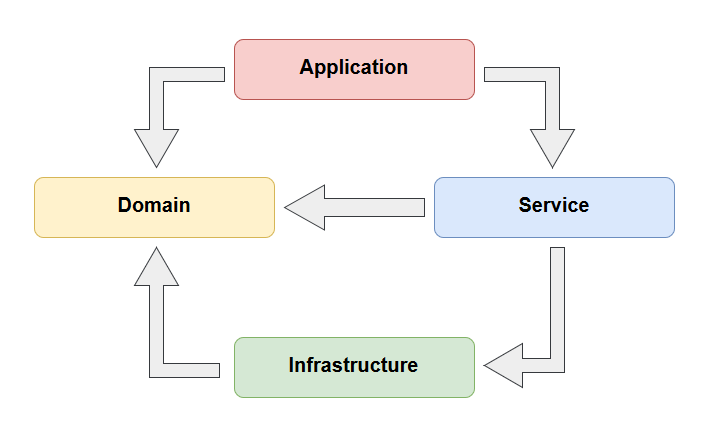

# Manager API

> Uma API Rest com .NET 5, EF Core e boas práticas.
[Arquitetura em .Net Core baseada nos princípios do DDD](https://alexalvess.medium.com/criando-uma-api-em-net-core-baseado-na-arquitetura-ddd-2c6a409c686)

<p align="center">
  
</p>

## Para rodar o projeto

#### Iniciar segredos de usuários:
```
dotnet user-secrets init
```

#### Configurar string de conexão com o banco de dados:
```
dotnet user-secrets set "ConnectionStrings:USER_MANAGER" "[STRING CONNECTION]"
```

#### Configurar dados de autenticação (JWT):
```
dotnet user-secrets set "Jwt:Key" "[JWT CRYPTOGRAPHY KEY]"
dotnet user-secrets set "Jwt:Login" "[JWT LOGIN]"
dotnet user-secrets set "Jwt:Password" "[JWT PASSWORD]"
```

#### Configurar chave de criptografia da aplicação:
```
dotnet user-secrets set "Cryptography" "[CHAVE DE CRIPTOGRAFIA DA APLICAÇÃO]"
```

<br>

## Alguns comandos úteis

#### Listar todas os segredos de usuário da aplicação:
```
dotnet user-secrets list
```

#### Deletar um segredo de usuário da aplicação:
```
dotnet user-secrets remove "[CHAVE]"
```

<br>

## Comandos utilizados durante a criação da API:

#### Adicionar nova soluçao:
```
dotnet new solution -o Manager.sln
```

#### Adicionar novo projeto de API:
```
dotnet new webapi -o Manager.API
```

#### Adicionar novo projeto biblioteca de classes:
```
dotnet new classlib -o Manager.Domain
dotnet new classlib -o Manager.Services
dotnet new classlib -o Manager.Infra
```

#### Adicionar JWT:
```
dotnet add package Microsoft.AspNetCore.Authentication.JwtBearer
dotnet add package Microsoft.AspNetCore.Authentication.OpenIdConnect
```

#### Adicionar FluentValidation:
```
dotnet add package FluentValidation
```

#### Adicionar Moq:
```
dotnet add package moq
```

#### Adicionar FluentAssertions:
```
dotnet add package fluentassertions
```

#### Adicionar Bogus:
```
dotnet add package bogus
```

#### Regex Validaçao de Email:
```
@"^([\w-\.]+)@((\[[0-9]{1,3}\.[0-9]{1,3}\.[0-9]{1,3}\.)|(([\w-]+\.)+))([a-zA-Z]{2,4}|[0-9]{1,3})(\]?)$"
```

#### Instalar o Entity Framework:
```
dotnet add package Microsoft.EntityFrameworkCore
dotnet add package Microsoft.EntityFrameworkCore.SqlServer
dotnet add package Microsoft.EntityFrameworkCore.Tools
dotnet add package Microsoft.EntityFrameworkCore.Design
```

#### Instalar AutoMapper:
```
dotnet add package AutoMapper
```

#### Adicionar um projeto na soluçao:
```
dotnet sln ..\..\Manager.sln add .\Manager.Domain.csproj
dotnet sln ..\..\Manager.sln add .\Manager.Services.csproj
dotnet sln ..\..\Manager.sln add .\Manager.Infra.csproj
dotnet sln ..\..\Manager.sln add .\Manager.Core.csproj
```

#### Adicionar referência de um projeto em outro:
```
dotnet add .\Manager.Infra.csproj reference '..\2 - Manager.Domain\Manager.Domain.csproj'
dotnet add '.\3 - Manager.Domain\Manager.Domain.csproj' reference '.\5 - Manager.Core\Manager.Core.csproj'
dotnet add .\Manager.Services.csproj reference '..\2 - Manager.Domain\Manager.Domain.csproj'
dotnet add .\Manager.Services.csproj reference '..\2 - Manager.Core\Manager.Core.csproj'
dotnet add .\Manager.Services.csproj reference '..\2 - Manager.Infraestructure\Manager.Infraestructure.csproj'
```

#### Adicionar Azure Key Vault:
```
dotnet add package Azure.Identity
dotnet add package Microsoft.Extensions.Configuration.AzureKeyVault
dotnet add package Azure.Security.KeyVault.Secrets
```

#### Criar projeto xUnit:
```
dotnet new xunit
```

#### Instalar ferramenta do EF Migrations:
```
dotnet tool install --global dotnet-ef --version 5.0.1
```

#### Criar a migration:
```
dotnet ef migrations add InitialMigration
```

#### Atualizar banco de dados com a migration:
```
dotnet ef database update
```

#### Remover migration:
```
dotnet ef migrations remove
```

#### Limpar projeto:
```
dotnet clean
```

#### Buildar projeto:
```
dotnet build
```

#### Publicar projeto localmente:
```
dotnet publish -c Release -o ./publish
```

#### Executar os testes:
```
dotnet test
```

#### User Secrets:
```
cd '.\1 - Manager.API' 
dotnet user-secrets init --project .\Manager.API.csproj
dotnet user-secrets list --project .\Manager.API.csproj
dotnet user-secrets set "ConnectionStrings:USER_MANAGER" "Data Source=DESKTOP-652APCE\SQLEXPRESS;Initial Catalog=USERMANAGERAPI;Integrated Security=True;Connect Timeout=30;Encrypt=False;TrustServerCertificate=False;ApplicationIntent=ReadWrite;MultiSubnetFailover=False" --project .\Manager.API.csproj
dotnet user-secrets set "Jwt:Key" "aXVuZmZzZHVpbmhmZHN1aWhzZGZ1bmlvc2RmaW5vcXdqaW9xZXdqaW8yM2o5MDMyMTkwcjIzNHIyMw==" --project .\Manager.API.csproj
dotnet user-secrets set "Jwt:Login" "javaruim" --project .\Manager.API.csproj
dotnet user-secrets set "Jwt:Password" "phptambem" --project .\Manager.API.csproj
dotnet user-secrets set "Cryptography" "SUA_CHAVE" --project .\Manager.API.csproj
```
